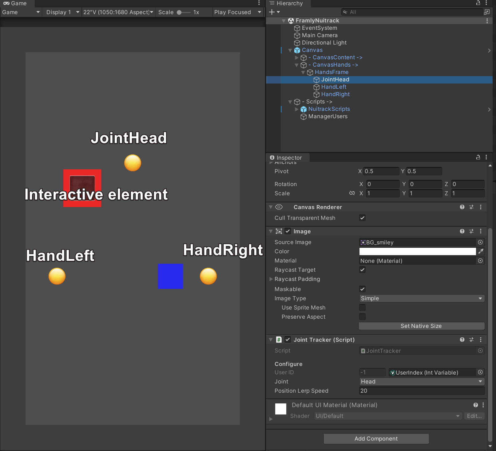

# **Samples Documentaion**

## **Framly Nuitrack Sample Scene**
Simple example of a basic configuration. This scene is able to hide object if no user is in the selected view assigned in ManagerUsers.cs with `UserSpacBox` struct 
 
